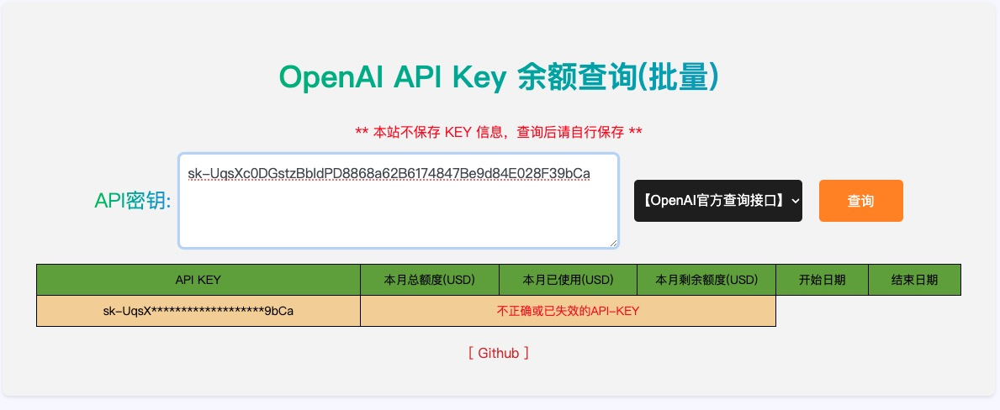

### 说明

- 境内无法通过直连访问openai查询key使用情况; (https://api.openai.com/dashboard/billing/credit_grants)

- python代码实现代理查询接口，然后通过Html前端展示；

- 可多个keys批量查询；

- 自行部署, 也可以根据自己的情况进行修改.


### 部署

```shell

python3 -m venv venv
source venv/bin/activate
pip install -r requirements.txt
# pip freeze | tee requirements.txt

python3 app.py
```

### 效果图

